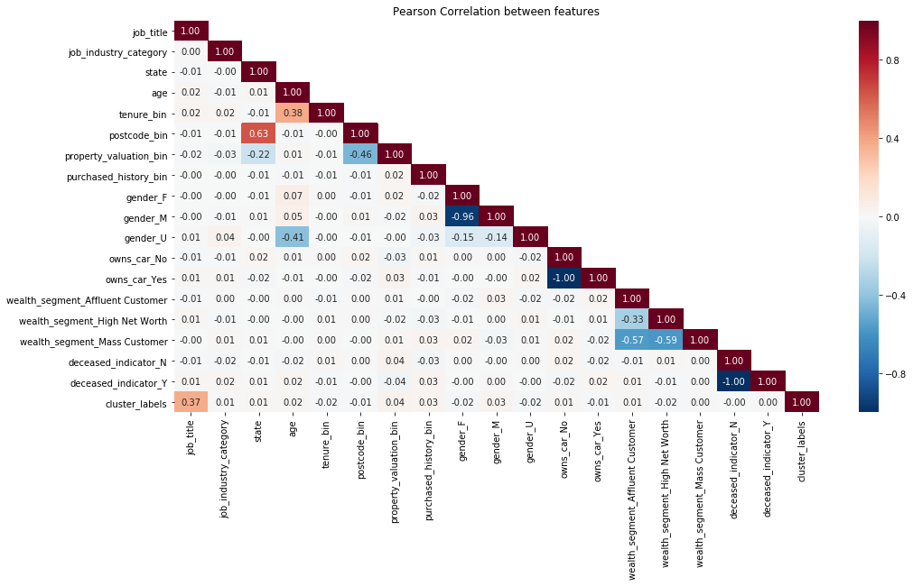

# Introduction
The KPMG virtual internship is an online program where a user can learn first-hand how does a data scientist analysis and provide insight into the customer's dataset in an end-to-end fashion. It is a good practice for anyone who wants to pursue a data scientist career. This is because, this exercise requires you to perform data quality analysis, data exploration, machine learning models development, models interpretation and summarize the result to the customer.

In practice, a data scientist needs to understand the data better than anyone else (including the customer). This indicates data scientists need to carry out all the tasks mentioned above (or more) so that they can tell "stories" based on the data! While all the data science course online did a great job on providing knowledge on the Machine Learning/AI models (which is one of the essential skills in becoming a successful data scientist), it is far from just developing and fine-tuning the ML/AI models. Hence, in my point of view, I think it is a good practice to participate in these virtual internships or Kaggle to understand what is the data scientist's job in real life!

Ok, enough talking. Let's get started!

# Aims and Objectives
The project aims to help a bike accessories company, Sprocket Central Pty Ltd, to target new customers in Australia.
To achieve this aim, the customer has provided three datasets for KPMG. The dataset are as follow:
* CustomerDemographics
* CustomerAddress
* Transaction

Based on the three datasets, you were asked to complete the following three tasks and submitted to the website for evaluation:
1. **Data Quality Analysis:** In this task, you were asked to analyze the quality of the dataset provided by the customer by identifying all the issues. Subsequently, you need to send an email to the customer summarizing the issues found.
2. **Data Exploration:** Explore and understanding the data distribution (i.e., customer personality, behaviors, etc.).
3. **Data Pre-processing:** Data cleaning, data transformation and features engineering. 
4. **Model Development:** Determine and development machine learning models.
5. **Result Interpretation:** Creating a powerpoint presentation which outlines the approaches you take for the data exploration, pre-processing and model development. 

Every task listed had to be approved by the customer before proceeding to the next stage. Hence a detailed explanation is required. 
So if you decide to use a deep neural network to analyze the customer behavior, make sure you can explain it to the customer...    

***Please note that the data scientist in KPMG might not reply or communicate with you during the process. A model answer will be provided on each stage and you have to conduct a self-assessment by comparing your's to the model answer.***

# Data Quality Analysis


# Data Pre-processing and Exploration
As the dataset provided are scattered, incomplete, inaccurate, inconsistent and invalid, it is difficult to explore the data distribution without any data pre-processing.
So, let's start by joining the CustomerDemographics and CustomerAddress file together through the *customer_id* and do some cleaning.

```bash
import numpy as np
import pandas as pd
import matplotlib
import matplotlib.pyplot as plt
import seaborn as sns

from datetime import datetime
from datetime import date

# read in all the dataset using pandas
df_trans  = pd.read_csv('dataset/transactions.csv')
df_cdemo  = pd.read_csv('dataset/customer_demographics.csv')
df_caddr  = pd.read_csv('dataset/customer_address.csv')
df_newc   = pd.read_csv('dataset/new_customer.csv')
df_nc_details = pd.read_csv('dataset/new_customer.csv')

# join the dataset on customer_id
df_cc_details = pd.merge(df_cdemo, df_caddr, how='left', on='customer_id')

# drop all the uneccessary features
df_train = df_cc_details.drop(columns=['first_name', 'last_name', 'default', 'country', 'address'], axis=0)

``` 
Notice that I drop a few features after I join two csv files together. 
This is because features like 'first_name' and 'last_name' does not provide any useful information on the maket or the customer, it could be disregard.
Furthermore, the value in 'country' is just 'Australia', we can also drop it. The next step is to ensure the data format consistency.

```bash
# unify the gender code
df_train['gender'] = df_train.gender.str.upper()
df_train.loc[df_train.gender.str.find('FEMA') >= 0, 'gender'] = 'F'
df_train.loc[df_train.gender.str.find('MAL') >= 0, 'gender']  = 'M'

# unify state to code
states_code = {'NEW SOUTH WALES': 'NSW',
               'QUEENSLAND'     : 'QLD',
               'VICTORIA'       : 'VIC'}

# state name to state code formating function
name2code = lambda name: states_code[name] \ 
                            if name in states_code.keys() \ 
                            else name

# fill the missing value with NSW
df_train.loc[df_train.state.isna(), 'state'] = 'NSW'

# convert the state name to upper case state code
df_train['state'] = df_train['state'].str.upper()
df_train['state'] = df_train['state'].apply(name2code)

```
I decide not to discuss the data transformation and missing value step, because the approaches taken are relative straight forward and could be found in the [*Data_Analysis.ipynb*](https://github.com/jacksenteh/KPMG_Virtual_Internship/blob/master/Data_Analysis.ipynb) file.
The rough pre-process dataset contains the following features: 



Not gonna lie, the data formatting, transformation, and cleaning took me 6 hours....
As you can see from the Pearson correlation plot, most of the customer demographics does not correlate with the number of bike accessory purchased (i.e., *purchased_history_bin*).
Be that as it may, the dataset is ready for us to explore. Before we move forward, I advise all the non-business major to read through some marketing strategies, such as [STP](https://devrix.com/tutorial/stp-model-of-marketing-segmentation-targeting-positioning/).
These strategies will provide guidance on how to approach this problem.


# Model Developments
The next stage is to develop the unsupervised learning model. If you are not familiar with unsupervised learning model, please read [Unsupervised Learning](https://towardsdatascience.com/10-machine-learning-methods-that-every-data-scientist-should-know-3cc96e0eeee9) 
and [Clustering model](https://towardsdatascience.com/the-5-clustering-algorithms-data-scientists-need-to-know-a36d136ef68).  