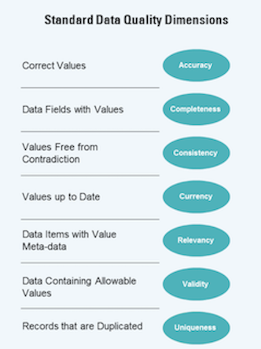
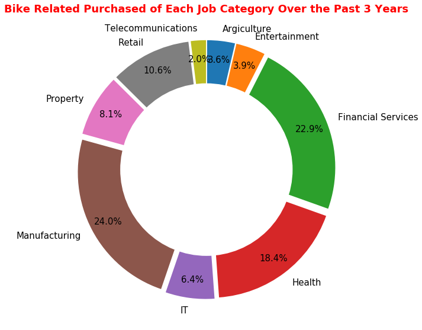
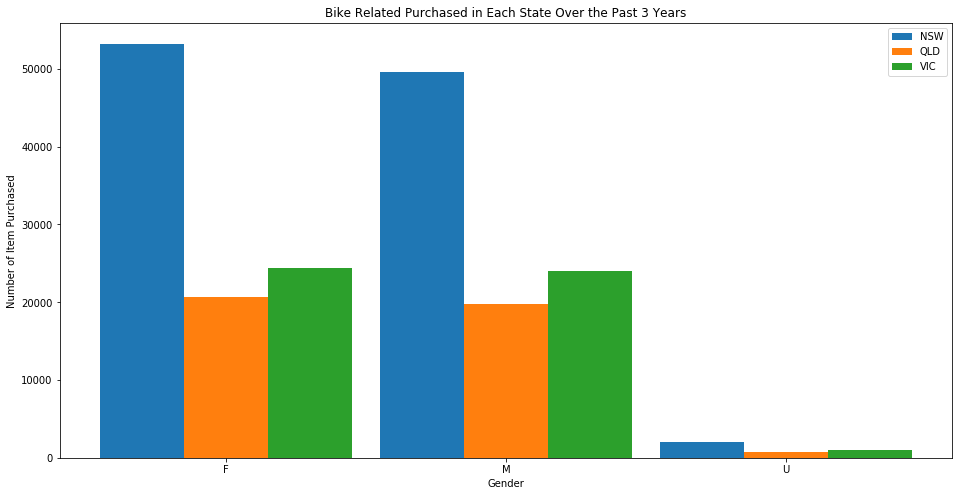

# Introduction
The KPMG virtual internship is an online program where a user can learn first-hand how does a data scientist analysis and provide insight into the customer's dataset in an end-to-end fashion. It is a good practice for anyone who wants to pursue a data scientist career. This is because, this exercise requires you to perform data quality analysis, data exploration, machine learning models development, models interpretation and summarize the result to the customer.

In practice, a data scientist needs to understand the data better than anyone else (including the customer). This indicates data scientists need to carry out all the tasks mentioned above (or more) so that they can tell "stories" based on the data! While all the data science course online did a great job on providing knowledge on the Machine Learning/AI models (which is one of the essential skills in becoming a successful data scientist), it is far from just developing and fine-tuning the ML/AI models. Hence, in my point of view, I think it is a good practice to participate in these virtual internships or Kaggle to understand what is the data scientist's job in real life!

Ok, enough talking. Let's get started!

# Aims and Objectives
The project aims to help a bike accessories company, Sprocket Central Pty Ltd, to target new customers in Australia.
To achieve this aim, the customer has provided three datasets for KPMG. The dataset are as follow:
* CustomerDemographics
* CustomerAddress
* Transaction

Based on the three datasets, you were asked to complete the following three tasks and submitted to the website for evaluation:
1. **Data Quality Assessment:** In this task, you were asked to analyze the quality of the dataset provided by the customer by identifying all the issues. Subsequently, you need to send an email to the customer summarizing the issues found.
2. **Data Exploration:** Explore and understanding the data distribution (i.e., customer personality, behaviors, etc.).
3. **Data Pre-processing:** Data cleaning, data transformation and features engineering. 
4. **Model Development:** Determine and development machine learning models.
5. **Result Interpretation:** Creating a powerpoint presentation which outlines the approaches you take for the data exploration, pre-processing and model development. 

Before working on the task, you need to remember that you goal is to provide strategies to the customer's marketing team. 
Every approaches you take should be interpretable to the customer! 
So if you decide to use a deep neural network to analyze the customer behavior, make sure you can explain it to the customer.

In this blog, I will not go through the data quality assessment. If you are new to this task, you can refer to the table below or google the data quality framework tables.

    

***Please note that the data scientist in KPMG might not reply or communicate with you during the process. A model answer will be provided on each stage and you have to conduct a self-assessment by comparing your's to the model answer.***


# Data Pre-processing and Exploration
As the dataset provided are scattered, incomplete, inaccurate, inconsistent and invalid, it is difficult to explore the data!
So, let's start by joining the CustomerDemographics and CustomerAddress file together through the *customer_id* and do some pre-processing and transformation.

```bash
import numpy as np
import pandas as pd
import matplotlib
import matplotlib.pyplot as plt
import seaborn as sns

from datetime import datetime
from datetime import date

# read in all the dataset using pandas
df_trans  = pd.read_csv('dataset/transactions.csv')
df_cdemo  = pd.read_csv('dataset/customer_demographics.csv')
df_caddr  = pd.read_csv('dataset/customer_address.csv')
df_newc   = pd.read_csv('dataset/new_customer.csv')

# join the dataset on customer_id
df_cc_details = pd.merge(df_cdemo, df_caddr, how='left', on='customer_id')

# drop all the uneccessary features
df_train = df_cc_details.drop(columns=['first_name', 'last_name', 'default', 'country', 'address'], axis=0)

``` 
Notice that I drop a few features after I join two csv files together. 
This is because features like 'first_name' and 'last_name' does not provide any useful information on the maket or the customer, it could be disregard.
Furthermore, the value in 'country' is just 'Australia', we can also drop it. The next step is to ensure the data format consistency.

```bash
# unify the gender code
df_train['gender'] = df_train.gender.str.upper()
df_train.loc[df_train.gender.str.find('FEMA') >= 0, 'gender'] = 'F'
df_train.loc[df_train.gender.str.find('MAL') >= 0, 'gender']  = 'M'

# unify state to code
states_code = {'NEW SOUTH WALES': 'NSW',
               'QUEENSLAND'     : 'QLD',
               'VICTORIA'       : 'VIC'}

# state name to state code formating function
name2code = lambda name: states_code[name] \ 
                            if name in states_code.keys() \ 
                            else name

# fill the missing value with NSW
df_train.loc[df_train.state.isna(), 'state'] = 'NSW'

# convert the state name to upper case state code
df_train['state'] = df_train['state'].str.upper()
df_train['state'] = df_train['state'].apply(name2code)

# convert DOB to age
df_train['age'] = df_train['DOB'].apply(DOB2Age)

```
Please note that a few functions have been left out on this blog. The complete code could be found in the [*Data_Analysis.ipynb*](https://github.com/jacksenteh/KPMG_Virtual_Internship/blob/master/Data_Analysis.ipynb) file.
After the rough pre-process and transformation, the dataframe obtain is shown below:


As you can see from the Pearson correlation plot, most of the customer demographics does not correlate with the number of bike accessory purchased (i.e., *purchased_history_bin*).
At this point, we can assume that 1) the pre-processing is not sufficient and required some features engineering
or 2) the customer demographics simply won't affect the market. 
Since we don't have enough information or evidence to verify our hypothesis, we should just move on to include the transaction data.


```bash
# drop un-necessary columns
df_trans_mod = df_trans.drop(columns=['transaction_id', 'product_id', 'product_first_sold_date', 'transaction_date'])
df_trans_mod = df_trans_mod.loc[df_trans_mod['product_class'].isna() == False]

# dummies
df_trans_mod = one_hot_encode_col(df_trans_mod, 'order_status')
df_trans_mod = one_hot_encode_col(df_trans_mod, 'product_class')
df_trans_mod = one_hot_encode_col(df_trans_mod, 'product_size')
df_trans_mod = one_hot_encode_col(df_trans_mod, 'product_line')
df_trans_mod = one_hot_encode_col(df_trans_mod, 'brand')

# reformatting the price format and convert it to float
str2currency = lambda string: float(re.sub(r'[$,]', '', string))
df_trans_mod.standard_cost = df_trans_mod.standard_cost.apply(str2ocurrency)

# group by customer id
df_group = df_trans_mod.groupby('customer_id')
df_group_sum = df_group.sum().reset_index()

# calculate the price variation between the standard cost and list price
df_group_sum['price_variation'] = df_group_sum.standard_cost - df_group_sum.list_price 

# rename columns for better understanding
df_group_sum = df_group_sum.rename(columns={'list_price'  : 'spending',
                                            'online_order': 'nb_purchased_online'})

# merge with df_train
df_train = pd.merge(df_train, df_group_sum, how='left', on='customer_id')

# drop na rows
df_train = df_train.dropna()

```
If you pay attention during the data quality assessment task, you should notice the relationship between df_trans_mod and df_train dataframe is many to one.
Furthermore, a few of the *customer_id* in df_trans_mod does not match with df_train *customer_id*. 
As you can see above, I solve these problems by simply grouping the customer and drop the mismatch customer.

Hopefully you understand why I do group then sum according to each customer.
If you don't understand, I encourage you to take some time and read through some marketing strategies, such as [STP](https://devrix.com/tutorial/stp-model-of-marketing-segmentation-targeting-positioning/).
These strategies will provide guidance on how to approach this problem.
In brief, the CustomerDemographics and CustomerAddress provide us information on **who** is our customer, while the grouping and summing of transaction could tell us **why** the customer buy.

Up until this point, our dataframe should have the following features and correlation:

With this plot, we can tell a lot of stories. On of the most obvious story is the price. The price variation has high inverse correlation with *spending* and *order_status_Approved*.
This shows that if the listed price of a product is closer to the standard cost (i.e., closer to 0), customer tends to buy more!
But since we got 36 features, the total number of combination without replacement is 36 factorial! How are we going to study that many relationships???

This is when machine learning model come in. Specifically unsupervised learning models.

# Model Developments
If you are not familiar with unsupervised learning model, please read [Unsupervised Learning](https://towardsdatascience.com/10-machine-learning-methods-that-every-data-scientist-should-know-3cc96e0eeee9) 
and [Clustering model](https://towardsdatascience.com/the-5-clustering-algorithms-data-scientists-need-to-know-a36d136ef68).
Here, we can start by using the basic clustering models, KMeans.

```bash
from sklearn.cluster import KMeans

model = KMeans(n_clusters=4, n_init=300, max_iter=3000, verbose=0)
model.fit(df_train)

# get the labels and each cluster center point
labels = set(model.labels_)
c_cluster = model.cluster_centers_

```
After that, we can use the center point of each cluster to check the market segmentation. 

## Who is your customer?
Let's find out who is the Sprocket Central Pty Ltd's customer. 
To achieve this, we can group the customer according to their demographics and address, such as *'job_categories'*.




From the plot above, we found that most of the customer came from New South Wales and work in Manufacturing, Financial Service, Health and Retails. 

## Why does your customer buy?


  