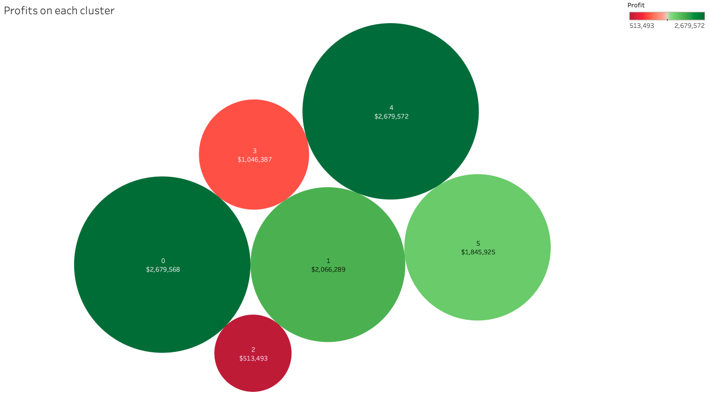
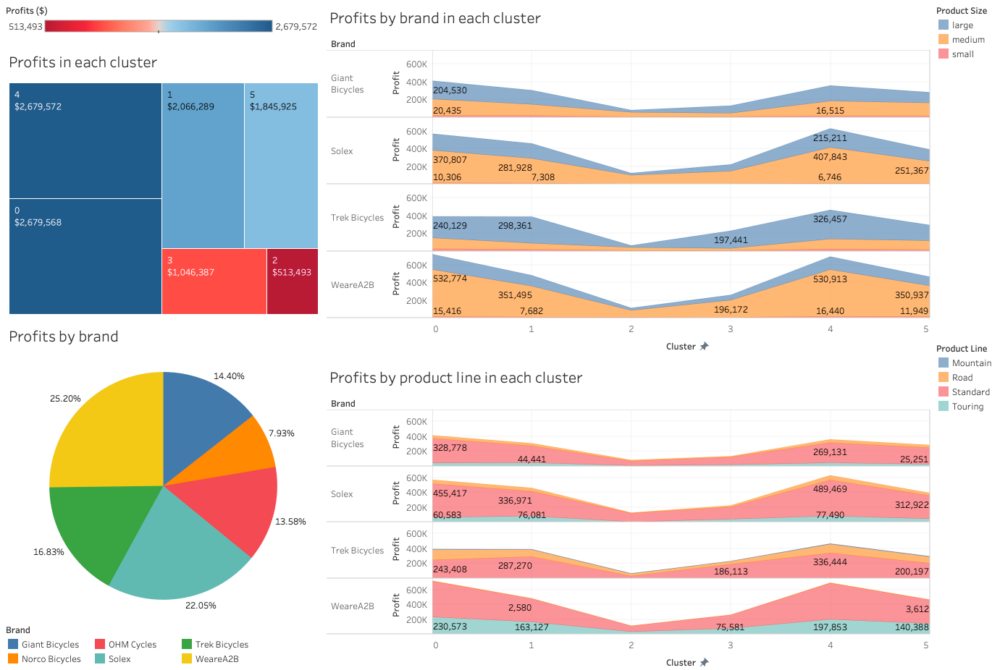

# Introduction
The KPMG virtual internship is an online program where a user can learn first-hand how does a data scientist analysis and provide insight into the customer's dataset in an end-to-end fashion. It is a good practice for anyone who wants to pursue a data scientist career. This is because, this exercise requires you to perform data quality analysis, data exploration, machine learning models development, models interpretation and summarize the result to the customer.

In practice, a data scientist needs to understand the data better than anyone else (including the customer). This indicates data scientists need to carry out all the tasks mentioned above (or more) so that they can tell "stories" based on the data! While all the data science course online did a great job on providing knowledge on the Machine Learning/AI models (which is one of the essential skills in becoming a successful data scientist), it is far from just developing and fine-tuning the ML/AI models. Hence, in my point of view, I think it is a good practice to participate in these virtual internships or Kaggle to understand what is the data scientist's job in real life!

Ok, enough talking. Let's get started!

# Aims and Objectives
The project aims to help a bike accessories company, Sprocket Central Pty Ltd, to target new customers in Australia.
To achieve this aim, the customer has provided three datasets for KPMG. The dataset are as follow:
* CustomerDemographics
* CustomerAddress
* Transaction

Based on the three datasets, you were asked to complete the following tasks and submitted to the website for evaluation:
1. **Data Quality Assessment:** In this task, you were asked to analyze the quality of the dataset provided by the customer by identifying all the issues. Subsequently, you need to send an email to the customer summarizing the issues found.
2. **Data Exploration:** Explore and understanding the data distribution (i.e., customer personality, behaviors, etc.).
3. **Data Pre-processing:** Data cleaning, data transformation and features engineering. 
4. **Model Development:** Determine and development machine learning models.
5. **Result Interpretation:** Creating a powerpoint presentation which outlines the approaches you take for the data exploration, pre-processing and model development. 

In this blog, I will not go through the data quality assessment. 
If you are new to this task, you can refer to the table below or google the data quality framework tables.


Before working on these tasks, you need to remember that your goal is to provide strategies to the customer's marketing team. 
This means that every approaches you take should be interpretable to the customer! 
So if you decide to use a deep neural network to analyze the market, make sure you can explain it to the customer.

***Please note that this projects leans toward principle rather than actual developing the models and analyse the result.
But if you want to practice your machine learning skills you are welcome to do so.***


# Data Pre-processing and Exploration
To perform well on this task, you need to form questions and hypothesis in business perspective.
For example, does a high net worth customer spends more on bike accessories (i.e., high quality accessory)?
Does a customer lives in big cities tends to choose cycle as their main transport to avoid traffic?
Does the price variation between the list price and standard cost affect the number of sales?
To answer these problems, you might need to reach out and gather the corresponding dataset.
But before that, we can start by working with what we got to see if we can answer some of the questions.
 
If you asses the quality of the three dataset at the beginning, you will find that the data is scattered, incomplete, inaccurate, inconsistent and invalid.
At this point, it is difficult to for us explore the data.
So, let's start by joining the CustomerDemographics and CustomerAddress file and perform pre-processing and transformation.

```bash
import numpy as np
import pandas as pd
import matplotlib
import matplotlib.pyplot as plt
import seaborn as sns

from datetime import datetime
from datetime import date

# read in all the dataset using pandas
df_trans  = pd.read_csv('dataset/transactions.csv')
df_cdemo  = pd.read_csv('dataset/customer_demographics.csv')
df_caddr  = pd.read_csv('dataset/customer_address.csv')
df_newc   = pd.read_csv('dataset/new_customer.csv')

# join the dataset on customer_id
df_cc_details = pd.merge(df_cdemo, df_caddr, how='left', on='customer_id')

# drop all the uneccessary features
df_train = df_cc_details.drop(columns=['first_name', 'last_name', 'default', 'country', 'address'], axis=0)

``` 
Notice that I drop a few features after I join two csv files together. 
This is because features like 'first_name' and 'last_name' does not provide any useful information on the maket or the customer, it could be disregard.
Furthermore, the value in 'country' is just 'Australia', we can also drop it. The next step is to ensure the data format consistency.

```bash
# unify the gender code
df_train['gender'] = df_train.gender.str.upper()
df_train.loc[df_train.gender.str.find('FEMA') >= 0, 'gender'] = 'F'
df_train.loc[df_train.gender.str.find('MAL') >= 0, 'gender']  = 'M'

# unify state to code
states_code = {'NEW SOUTH WALES': 'NSW',
               'QUEENSLAND'     : 'QLD',
               'VICTORIA'       : 'VIC'}

# state name to state code formating function
name2code = lambda name: states_code[name] if name in states_code.keys() else name

# fill the missing value with NSW
df_train.loc[df_train.state.isna(), 'state'] = 'NSW'

# convert the state name to upper case state code
df_train['state'] = df_train['state'].str.upper()
df_train['state'] = df_train['state'].apply(name2code)

# convert DOB to age
df_train['age'] = df_train['DOB'].apply(DOB2Age)

```
Please note that a few functions have been left out on this blog. The complete code could be found in the [*Data_Analysis.ipynb*](https://github.com/jacksenteh/KPMG_Virtual_Internship/blob/master/Data_Analysis.ipynb) file.
After the imprudent pre-process and transformation, we should have the following dataframe:


As you can see from the Pearson correlation plot, most of the customer demographics does not correlate with the number of bike accessory purchased (i.e., *purchased_history_bin*).
At this point, we can assume that 1) the pre-processing is not sufficient and required some features engineering
or 2) the customer demographics simply won't affect the market. 
As I mentioned earlier, let's just work on what we have first which is merging with the transaction data.


```bash
# drop un-necessary columns
df_trans_mod = df_trans.drop(columns=['transaction_id', 'product_id', 'product_first_sold_date', 'transaction_date'])
df_trans_mod = df_trans_mod.loc[df_trans_mod['product_class'].isna() == False]

# dummies
df_trans_mod = one_hot_encode_col(df_trans_mod, 'order_status')
df_trans_mod = one_hot_encode_col(df_trans_mod, 'product_class')
df_trans_mod = one_hot_encode_col(df_trans_mod, 'product_size')
df_trans_mod = one_hot_encode_col(df_trans_mod, 'product_line')
df_trans_mod = one_hot_encode_col(df_trans_mod, 'brand')

# reformatting the price format and convert it to float
str2currency = lambda string: float(re.sub(r'[$,]', '', string))
df_trans_mod.standard_cost = df_trans_mod.standard_cost.apply(str2ocurrency)

# group by customer id
df_group = df_trans_mod.groupby('customer_id')
df_group_sum = df_group.sum().reset_index()

# calculate the price variation between the standard cost and list price
df_group_sum['price_variation'] = df_group_sum.standard_cost - df_group_sum.list_price 

# rename columns for better understanding
df_group_sum = df_group_sum.rename(columns={'list_price'  : 'spending',
                                            'online_order': 'nb_purchased_online'})

# merge with df_train
df_train = pd.merge(df_train, df_group_sum, how='left', on='customer_id')

# drop na rows
df_train = df_train.dropna()

```

If you pay attention during the data quality assessment task, you should notice the relationship between df_trans_mod and df_train dataframe is many to one.
Furthermore, a few of the *customer_id* in df_trans_mod does not match with df_train *customer_id*. 
As you can see above, I solve these problems by simply grouping the customer and drop the mismatch customer.

Up until this point, our dataframe should have the following features and correlation:

The total number of features we have is 36. 
To study the relationship between variables, we had to go through all the possible combination which is 36 factorial! 
Correct me if I am wrong, but I don't think going through each combination manually is the smart way for a data scientist.

If you are a business major, you might have some techniques how to analysis the market and customer.
But since I am not a business major, I will train clustering models to help me do that.


# Model Developments
If you are not familiar with unsupervised learning model, please read [Unsupervised Learning](https://towardsdatascience.com/10-machine-learning-methods-that-every-data-scientist-should-know-3cc96e0eeee9) 
and [Clustering model](https://towardsdatascience.com/the-5-clustering-algorithms-data-scientists-need-to-know-a36d136ef68).
Here, we can start by using the basic clustering models, KMeans, and the elbow method to determine the number of clusters (refer to this [blog](https://towardsdatascience.com/k-means-clustering-with-scikit-learn-6b47a369a83c) for more information about the elbow method).


```bash
from sklearn.cluster import KMeans

cluster_sse = []

for i in range(3, 8):
    model = KMeans(n_clusters=i, n_init=300, max_iter=3000, verbose=0)
    model.fit(df_train)
    cluster_sse.append(model.inertia_)

```


Recall, the used of elbow method is to identify the number of cluster by locating the value where it decrease most rapid.
From the plot above, we can see that the suitable value should be 6.
To make sure each cluster does not overlap with each other, we can do a fast check on the profits of each cluster.



So it seems like each cluster is different to each other. 
Hence, we can start dig deeper into each cluster and find out why is it different. 
Before we start, let's recall the aim of this project. The aim of this project is to help Sprocket Central Pty Ltd target new customer.
But what is the right way to target the customer  

## Who is your customer?


## what did your customer buy?


## who buy what?
With the two dashboard above we can summarize the customer on each cluster contain the following demographics and behavior:

**Cluster 4:**
* Female customer 
* Age around 40 y/o.
* Work in Financial Service or Manufacturing.
* Prefer medium size WeareA2B and Solex product.
* Prefer standard or touring bike.

**Cluster 0:**
* Female customer 
* Age around 41 y/o.
* Work in Manufacturing.
* Prefer medium size WeareA2B and Solex product.
* Prefer standard or touring bike.

**Cluster 1:**
* Male customer 
* Age around 42 y/o.
* Work in Financial Service.
* Prefer medium size WearA2B and large Trek Bicycle.
* Prefer standard bike

Hence, the target customer priority should be rank as: cluster 4, 0, 1, 5, 3 and 2, if your strategies is to help the company gain the highest profit.

# Conclusion
The approaches I took in this project is to target the customer who can help generate high profit for Sprocket Central Pty Ltd.
There might be a better approach in business perspective.
Please note that the dashboard does not represent the whole market distribution. 

Depends on what is your business strategies, the dashboard presented to the customer should be different.
For example, the high net worth customer had a spend more than mass customer on average, but the number of customer in significant lower than mass customer.
In this case, should you advise Sprocket Central Pty Ltd. to target high net worth customer in certain state of Australia?

For me, the whole project took me 3 days to complete and the approaches I took is just the tip of the ice on what could be done to analysis the market.
After completing this project, I realise the skills required for this project are as follow:
* 40% on data analysis - data quality assessment, pre-processing and exploration. 
* 35% on marketing - marketing strategies (e.g., STP), statistical testing on the hypothesis made on the market trend.
* 15% on machine learning - model development.
* 10%  on presentation - Powerpoint and Tableau.

This project is no doubt a data scientist job, but as you can see its not always about machine learning, deep learning or AI model development! 
In my perspective, the key value of data scientist is the ability of analysis big data in the most efficient way (i.e., machine learning and deep learning) and provide accurate estimation.
Hopefully, the approaches I describe above is clear. 
If you got a questions or suggestion, feel free to send me an [email](jacksenteh@gmail.com) or find me on [twitter](https://twitter.com/Jacksen1995).
Thank you for reading!

